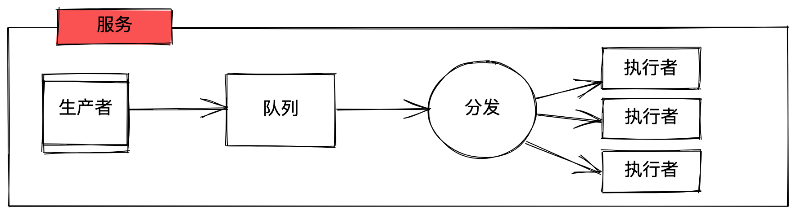

# 单机轻量的任务队列

可以将任务放在 kv 存储，内存等存储方式的任务队列。

设计图:

## 内存版

内存版本，任务消息存储在内存中。不能进行持久化。

* [x] - 内存队列
* [x] - 添加 goroutine 池

## 功能列表

* [ ] - 多种 kv 存储的方式(leveldb, bbolt)
* [x] - 任务重试
* [ ] - 支持 HTTP，GRPC 方式提交任务

## 场景描述

TODO
